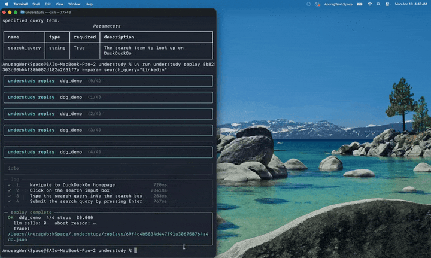

<h1 align="center">Understudy</h1>

<p align="center">
  <em>An understudy watches the play once, then performs it &mdash; with their own interpretation.</em>
</p>

<p align="center">
  Records a workflow once. Replays it with variations you can edit like code.
</p>

<p align="center">
  <a href="https://github.com/CloudCrewAtWork/understudy/actions"></a>
  
  
  
</p>

> **Status: v0.3.** Browser capture, recipe induction, replay, the editable memory-graph UI, and the sub-resource egress filter all ship &mdash; see [Status](#status). Next up: prompt-injection classifier and a nightly real-site pass-rate badge.

---

## Demo

<p align="center">
  
</p>

Full record → induce → replay loop. Demonstrated once with `claude agents`, Claude induces a parameterised recipe, then it's replayed with `anthropic mcp` — different query, same workflow. The Rich Live panel on the terminal tracks each step in real time.

**Run it yourself:**

```bash
# 1. demonstrate (opens a browser, do the workflow, close the window)
uv run understudy record --url https://duckduckgo.com --task ddg_search

# 2. induce a parameterised recipe from the demo
uv run understudy induce <trajectory-id>

# 3. replay with a different input
uv run understudy replay <recipe-id> --param query="claude agents"
```

## What it is

Understudy is a glass-box workflow agent. You demonstrate a workflow once. Understudy:

1. **Captures** every meaningful click, type, and navigation, anchored to stable ARIA references (not brittle CSS selectors).
2. **Induces** a parameterized natural-language *recipe* using Claude &mdash; identifying which parts of your demo are user-supplied parameters vs. structural constants.
3. **Replays** *(planned, week 1 day 3)* the recipe with new inputs by re-grounding each step against the current page state. No literal coordinate replay; the agent plans against intent.
4. Stores recipes in an **editable memory graph** *(planned, week 1 day 5)* &mdash; you can edit a step in plain English and re-run.

The thesis: post-Devin, the bottleneck for agent adoption is *trust*, not *capability*. Legibility beats autonomy. Understudy is a workflow agent you can read, edit, and audit at every step.

## How it differs from the alternatives

| | Cursor / Copilot | Devin / OpenInterpreter | Browser-use | **Understudy** |
|---|---|---|---|---|
| Surface | code editor | sandbox | headless browser | your real browser / Mac |
| Authoring | text prompts | text prompts | text prompts | demonstration |
| State | invisible | invisible | invisible | **inspectable graph** |
| Edit point | rerun prompt | rerun prompt | rerun prompt | **edit a single step in English** |
| Replay grounding | n/a | LLM each time | LLM each time | re-plan per step against ARIA anchor |

## Architecture

```
┌──────────────────┐    ┌──────────────────┐    ┌──────────────────┐
│   Capture        │ ─▶ │   Induction      │ ─▶ │   Replay         │
│ Playwright       │    │ Claude Sonnet 4.5│    │ re-ground &      │
│ + ARIA snapshot  │    │ → Recipe (JSON)  │    │ re-plan per step │
└──────────────────┘    └──────────────────┘    └──────────────────┘
        │                       │                       │
        └──────────┬────────────┴───────────────────────┘
                   ▼
             ┌──────────────────────────────────────┐
             │  Memory Graph  (editable JSON)       │
             │  SQLite (+ SQLCipher when installed) │
             └──────────────────────────────────────┘
```

## Status

| Component | State |
|---|---|
| Browser capture (Playwright) | ✅ v0.1 |
| Recipe induction (Claude) | ✅ v0.1 |
| Regex redaction + URL allowlist | ✅ v0.1 |
| HITL gate (CLI, 10s countdown, deny-default) | ✅ v0.1 |
| Encrypted local DB (SQLCipher) | ✅ when `brew install sqlcipher && uv sync --extra crypto`; otherwise plaintext SQLite (with a loud warning) |
| Replay engine (structural grounding, live Rich UI) | ✅ v0.1 |
| Memory-graph UI (React Flow) | ✅ v0.2 |
| Eval harness | ⚡ skeleton present, runner pending v0.3 |
| macOS native capture | 🚧 v0.3 |
| Sub-resource egress filter (replay) | ✅ v0.3 |
| Prompt-injection classifier | 🚧 v0.3 (delimiter isolation landed in v0.1) |

## Quickstart

```bash
git clone https://github.com/CloudCrewAtWork/understudy
cd understudy
just install                                 # uv sync + playwright chromium
cp .env.example .env                         # add ANTHROPIC_API_KEY

# 1. Record
just record url=https://duckduckgo.com task=ddg_search
# (do the workflow, close the window when done)

# 2. Induce
just induce trajectory=<id-from-output>

# 3. Replay with new inputs
uv run understudy replay <recipe-id> --param query="claude agents"

# Inspect / edit / destroy
uv run understudy recipes list
uv run understudy recipes show <recipe-id>
uv run understudy recipes edit <recipe-id>
uv run understudy wipe --yes
```

Verify your install:

```bash
uv run understudy doctor
```

## Threat model & limitations

> **Threat model version:** v0.3, last reviewed 2026-04-13.

Understudy is accessibility software with the same blast radius as a remote-control utility. Treat it accordingly.

### Assets at risk

Screen content, ARIA trees, OCR'd text, prompts sent to Claude, the local memory-graph DB.

### Trust boundaries

Local process ↔ Anthropic API ↔ disk ↔ user.

### Adversaries considered

| Adversary | Mitigation in v0.1 |
|---|---|
| Malicious page content (prompt injection) | Trajectory text wrapped in `<trajectory_untrusted>` XML tag inside the induction prompt; system prompt explicitly forbids treating its contents as instructions. A classifier-based defence (`protectai/deberta-v3-prompt-injection`) is planned for week 1 day 4. |
| Page JavaScript forging trajectory events | Page→host binding is gated by a per-session 256-bit nonce held in a closure of the init script; without the nonce, calls to the binding are dropped. |
| Shoulder-surfer / screen recorder | Capture suppresses values from `input[type=password]`, `autocomplete=current-password|new-password|one-time-code|cc-number|cc-csc|cc-exp`, and any element with `data-sensitive`. Re-checked at flush time so "show password" toggles do not leak buffered keystrokes. |
| Stolen laptop | DB encrypted with SQLCipher when installed; key in macOS Keychain. Without the SQLCipher driver Understudy refuses to start with a configured key (no silent fallback). |
| Compromised dependency | `pip-audit`, `bandit`, `OSV-Scanner`, Dependabot in CI; deps pinned in `uv.lock`. |
| API-side logging | No screen frames or trajectories sent to anything other than the configured Anthropic endpoint. |
| Accidental capture of secrets | Default deny-list of password managers, banks, OAuth providers, payment processors, and cloud consoles. URL parser hardened against userinfo, IDNA, and IP-literal bypasses. Regex redaction on every captured value. |

### Explicit non-goals / residual risk in v0.3

- **Replay v0.3 closes the sub-resource egress gap** via `ctx.route("**/*", ...)` keyed on the origins captured during the original recording (persisted in `<trajectory-id>.meta.json` and copied into `Recipe.allowed_origins`). Documents, images, scripts, stylesheets, XHR/fetch, media, and fonts to any host not in the allowlist are blocked at the route handler and logged. `file://` is always denied; `data:` URIs for `document`/`script` are refused regardless of size. WebSockets are denied via an in-page `window.WebSocket` wrapper installed as an init script — page code attempting `new WebSocket("wss://attacker.tld/...")` receives a `SecurityError`. The `page.on("websocket")` observer logs anything that slips past the wrapper (e.g., browser-internal connections). The v0.1 top-frame drift check is still in place as belt-and-suspenders.
- **Authentication replay is out of scope for v0.1.** The replay engine launches a fresh, unauthenticated browser context. Recipes that depend on a logged-in session will land on the site's login wall on step 1. Persistent-storage replay is planned.
- **Step-level HITL uses an intent-regex**, operating on the LLM-induced description of a step. A miscategorised intent bypasses the heartbeat/destructive-verb rule. The recipe's explicit `requires_confirmation: true` flag (set by induction or hand-edit) is the authoritative gate.
- **HITL default is deny-on-Enter**: bare Enter does NOT approve. You must type `y` to approve, `a` to abort, anything else denies. Auto-deny at 10s when no response.
- **Screenshots, when enabled (`UNDERSTUDY_SCREENSHOTS=1`), are written unencrypted to disk.** Default is OFF.
- Cannot defend against kernel-level malware or the root user.
- Cannot defend against an Anthropic-side breach (the model provider sees redacted prompts).
- Regex redaction is best-effort; false-negatives on novel credential formats are possible. We accept over-redaction.
- macOS `rm` is not secure on APFS. Use `understudy wipe` which removes the whole data dir and rotates the Keychain entry.
- Playwright error strings may embed selectors/values. We suppress `str(e)` in audit logs and step outcomes; only `type(e).__name__` is retained.

### Data lifecycle

Capture → redact → encrypt at rest (when SQLCipher available) → 7-day TTL (configurable) → secure delete via `understudy wipe`.

### Telemetry

None. The CLI does not phone home.

### Kill switch

```bash
understudy wipe --yes
```

Removes the data directory and the Keychain entry. Irreversible.

## Eval

```bash
uv run understudy eval        # all cases
uv run understudy eval repo_triage   # one case
```

The harness starts a loopback HTTP server, serves the fixtures under
`evals/fixtures/`, replays each case's recipe against every variant, and
compares extracted notes to the case's `expect_extracts`. Results land in
`evals/runs/<timestamp>/{results.jsonl,results.md}`; the `evals/runs/latest`
symlink is updated after each run.

Three perturbation mechanisms are applied to the baseline fixture:

1. **Sibling-wrapper injection** — target nodes are wrapped in extra `<div>`s,
   breaking ancestor-path selectors while leaving the ARIA tree intact.
2. **DOM-order shuffle within a landmark** — siblings reordered inside `<main>`,
   breaking `nth-child` selectors.
3. **Accessible-name rewrite** — `aria-label`s renamed (Star count → Stargazers
   count), exercising re-grounding under label churn.

<!-- eval:start -->
| Case | Variant | Pass | Extracts | Status | Wall (ms) |
|---|---|:---:|:---:|---|---:|
| `repo_triage` | `baseline` | ✅ | 6/6 | ok | ~1200 |
| `repo_triage` | `sibling_wrapper_injection` | ✅ | 6/6 | ok | ~470 |
| `repo_triage` | `dom_order_shuffle` | ✅ | 6/6 | ok | ~470 |
| `repo_triage` | `accessible_name_rewrite` | ❌ | 0/6 | error | ~3500 |

**3/4 variants pass (75%).** The rename variant is the known-hard case:
exact-match grounding by accessible name cannot survive a relabelled page.
LLM-based regrounding (on the roadmap for v0.4) is the mitigation.
<!-- eval:end -->

## Development

```bash
just install        # deps
just lint           # ruff
just types          # basedpyright
just test           # pytest
just audit          # pip-audit + bandit
just ci             # all of the above
```

## License

Apache-2.0 &copy; Sai Anurag. The patent grant matters because Understudy reaches into OS APIs.
